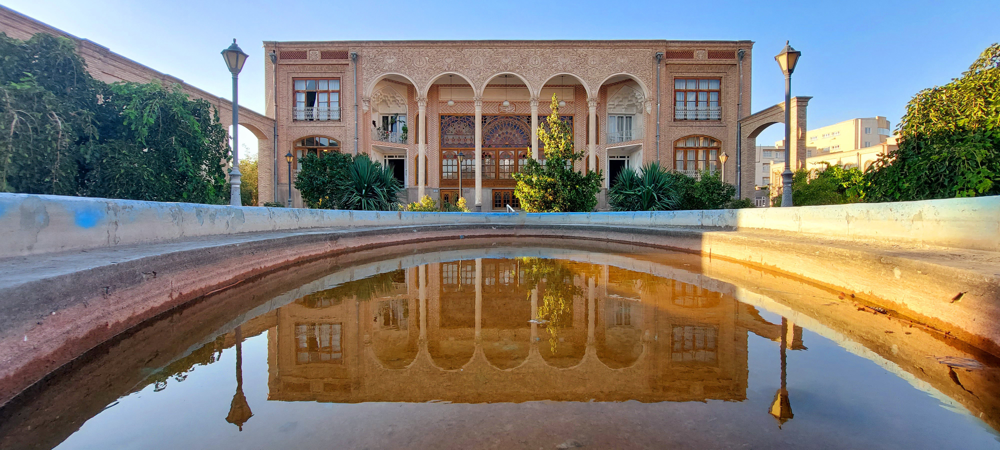
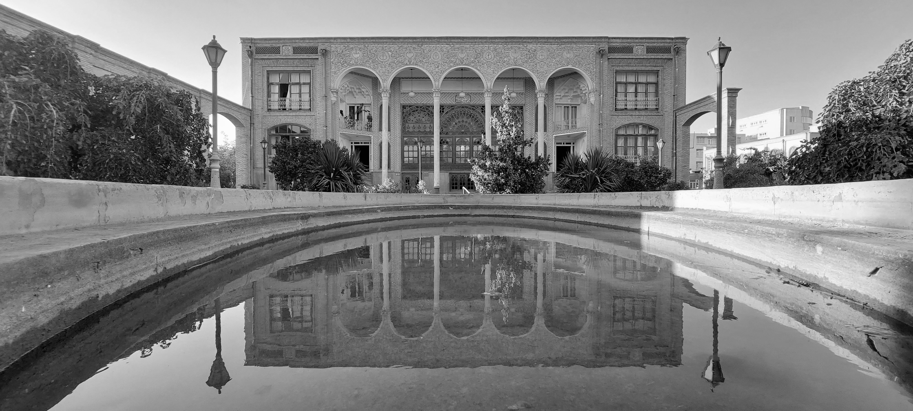
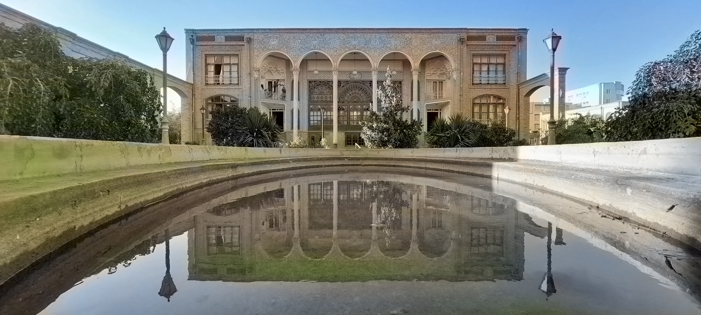
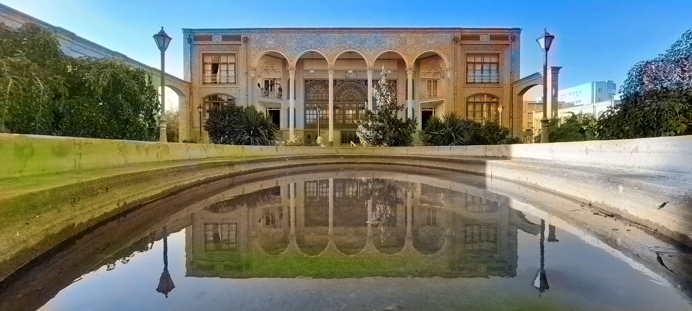

# Colorize-Grayscale-Images
This project demonstrates how to colorize black-and-white (grayscale) photos using a pre-trained deep learning model in OpenCV's DNN module. It uses a Caffe model trained for image colorization, restoring realistic colors to old or grayscale photos with minimal code.

data set link : https://storage.openvinotoolkit.org/repositories/datumaro/models/colorization/

| Mansion | Grayscale |
|--------|---------|
|  |  |

| Dead Colorized | Colorized |
|--------|---------|
|  |  |
